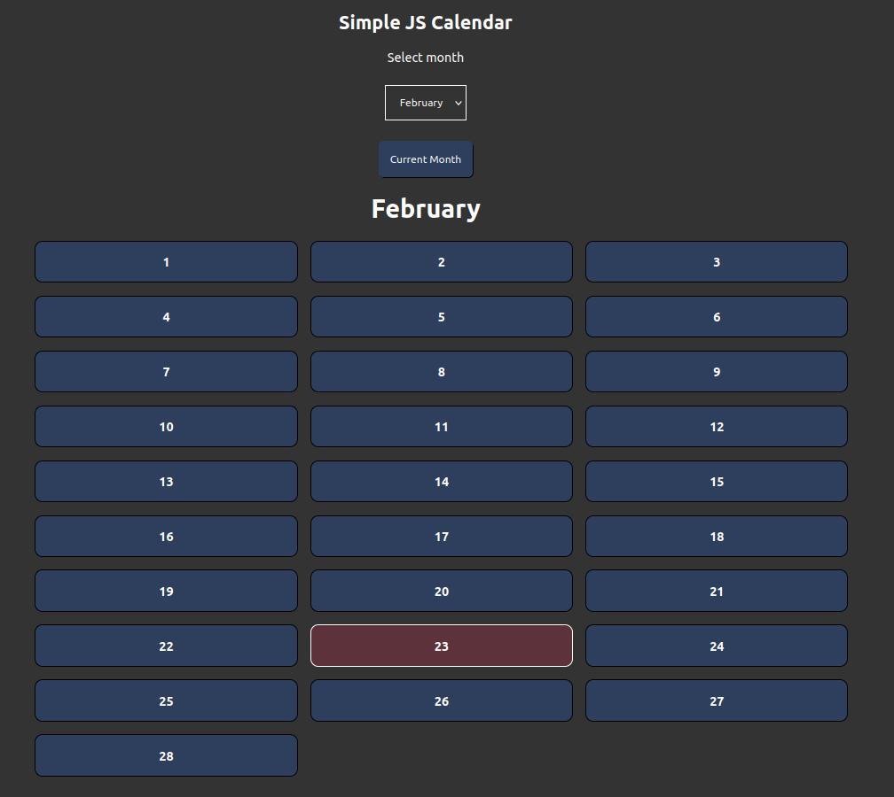

# simple_js_calendar

## What is this?
A simple HTML document with a choice of month and an h1-tag showing your choice as well as an unordered list with the number of days as list items.
Based on https://developer.mozilla.org/en-US/docs/Learn/JavaScript/Building_blocks/conditionals.

## Example Image
